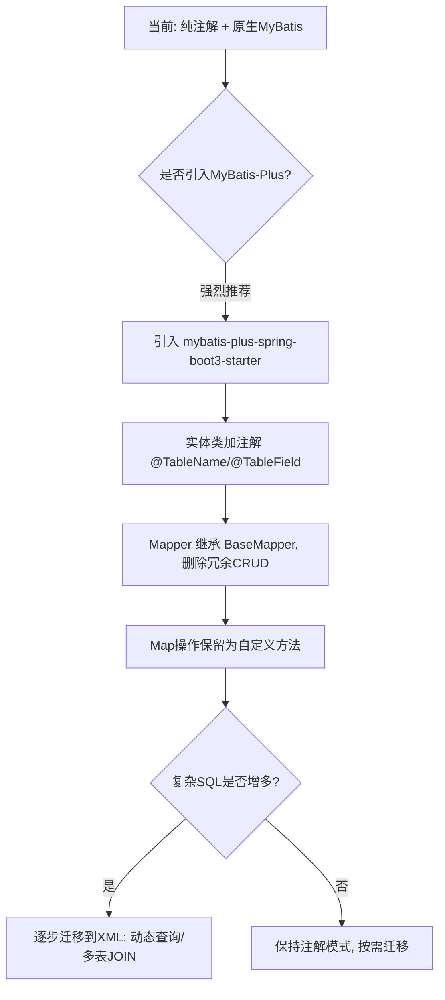

## 当前 MyBatis 使用现状分析

你的项目当前情况是：

| 维度 | 现状 |
|------|------|
| ORM 框架 | 原生 `mybatis-spring-boot-starter` 3.0.4 |
| 映射方式 | **纯注解模式**（`@Select` / `@Insert` / `@Update` / `@Delete`） |
| XML 文件 | **无**（虽然 `application.yml` 配了 `mapper-locations: classpath:mapper/*.xml`，但目录下没有 XML） |
| Mapper 数量 | 18 个接口 |
| SQL 复杂度 | 大多是简单 CRUD，少量 JOIN（如 `SysUserMapper.findAllAsMap`），**无动态 SQL** |
| 特殊模式 | 大量 `findAllAsMap()` / `insertMap()` / `updateMap()` 等 `Map<String, Object>` 操作 |

核心问题在于：**每个 Mapper 都在重复编写几乎一模一样的 CRUD**，例如：

```29:64:backend/src/main/java/com/cqutcm/biomed/mapper/GrowthRecordMapper.java
    @Select("SELECT * FROM growth_record ORDER BY recorded_at DESC")
    List<GrowthRecord> findAll();

    // ... 中间一堆几乎相同的 insert/update/delete/count/exists ...

    @Select("SELECT COUNT(*) FROM growth_record")
    int count();

    @Select("SELECT COUNT(*) > 0 FROM growth_record WHERE id = #{id}")
    boolean exists(String id);
```

这种模式在 18 个 Mapper 中反复出现，代码冗余非常严重。

---

## 问题一：是否需要改成 XML 模式？

### 短期结论：**不迫切，但有部分场景值得迁移**

**不建议全量迁移的理由：**

1. 当前 SQL 绝大多数是简单的单表 CRUD，注解模式完全够用，迁到 XML 反而增加了文件数量和跳转成本。
2. 目前**没有动态 SQL 需求**（无条件查询、分页、批量操作），而 XML 最大的优势就是 `<if>` / `<foreach>` / `<where>` 等动态标签。
3. 项目规模不大（18 个 Mapper），注解的可读性尚可接受。

**值得迁移到 XML 的场景（如果未来出现）：**

| 场景 | 说明 |
|------|------|
| 多表关联复杂查询 | 如 `SysUserMapper.findAllAsMap()` 那种多行字符串拼接的 JOIN，放 XML 里可读性更好 |
| 动态条件查询 | 前端传可选筛选条件时，需要 `<if>` / `<where>` |
| 批量插入/更新 | 需要 `<foreach>` |
| SQL 片段复用 | 用 `<sql>` + `<include>` 减少重复 |

**建议做法：** 保持注解模式为默认，仅对复杂 SQL 逐步迁移到 XML。MyBatis 本身支持注解和 XML **混用**——同一个 Mapper 接口里，简单方法用注解，复杂方法对应 XML，两者共存。

---

## 问题二：是否需要引入 MyBatis-Plus？

### 结论：**强烈建议引入**，收益远大于成本

#### 当前痛点（引入 MyBatis-Plus 可直接解决）

**痛点 1：CRUD 代码高度重复**

18 个 Mapper 中，`findAll` / `findById` / `insert` / `update` / `deleteById` / `count` / `exists` 这些方法几乎逐字重复。引入 MyBatis-Plus 后，继承 `BaseMapper<T>` 即可免费获得这些方法：

```java
// 改造前：手写全部 SQL
@Mapper
public interface HerbMapper {
    @Select("SELECT * FROM herb ORDER BY created_at DESC")
    List<Herb> findAll();
    @Select("SELECT * FROM herb WHERE id = #{id}")
    Herb findById(String id);
    @Insert("INSERT INTO herb (...) VALUES (...)")
    int insert(Herb herb);
    // ... 还有 update / delete / count ...
}

// 改造后：BaseMapper 自动提供
public interface HerbMapper extends BaseMapper<Herb> {
    // 只需写非标准查询，标准 CRUD 全部省略
}
```

**痛点 2：Service 层大量手动 Map ↔ Entity 转换**

`StructuredRecordService` 里有近 300 行代码，其中大量是 `mapToHerb()` / `herbToMap()` 这类手工转换。MyBatis-Plus 配合 `@TableName` / `@TableField` 注解可以自动完成映射，减少手写转换代码。

**痛点 3：分页能力缺失**

当前没有分页查询，如果要加，原生 MyBatis 需要手写 `LIMIT` 和 `COUNT`。MyBatis-Plus 内置 `IPage` 分页插件，一行代码搞定。

**痛点 4：缺少字段自动填充**

`created_at` / `updated_at` 这类审计字段，当前每个 `insert` / `update` SQL 里都手动写 `NOW()`。MyBatis-Plus 的 `MetaObjectHandler` 可全局自动填充。

#### 引入成本

| 项目 | 成本 |
|------|------|
| 依赖替换 | 将 `mybatis-spring-boot-starter` 换为 `mybatis-plus-spring-boot3-starter`（兼容 Spring Boot 3.3 + Java 21） |
| 实体类改造 | 加 `@TableName` / `@TableId` / `@TableField` 注解 |
| Mapper 改造 | 继承 `BaseMapper<T>`，删除冗余的 CRUD 方法 |
| 特殊处理 | `findAllAsMap()` 这类 Map 操作仍需保留自定义方法（可用注解或 XML） |

#### 注意事项

你项目中大量使用 `Map<String, Object>` 作为返回类型（如 `findAllAsMap`、`insertMap`），这是为了前端动态字段名映射。这部分**不适合用 MyBatis-Plus 的 BaseMapper**，需要保留为自定义方法。但这类方法本身也可以简化——利用 MyBatis-Plus 的 `@Select` 注解或 XML，配合 `<resultMap>` 自动映射，避免手动 `AS herbName` 这种别名。

---

## 综合建议



### 推荐的渐进式改造路线

1. **第一步（高收益）**：引入 MyBatis-Plus，让 Mapper 继承 `BaseMapper`，消除重复 CRUD 代码
2. **第二步（中收益）**：给实体类加 `@TableField` 自动映射，删除 `findAllAsMap` 里手写的 `AS xxx` 别名
3. **第三步（按需）**：仅当出现动态条件查询、复杂报表 SQL 时，再引入 XML 文件处理这些特定方法

这样既避免了过度设计（全量迁移 XML），又能获得 MyBatis-Plus 的核心收益（消灭 CRUD 样板代码）。
